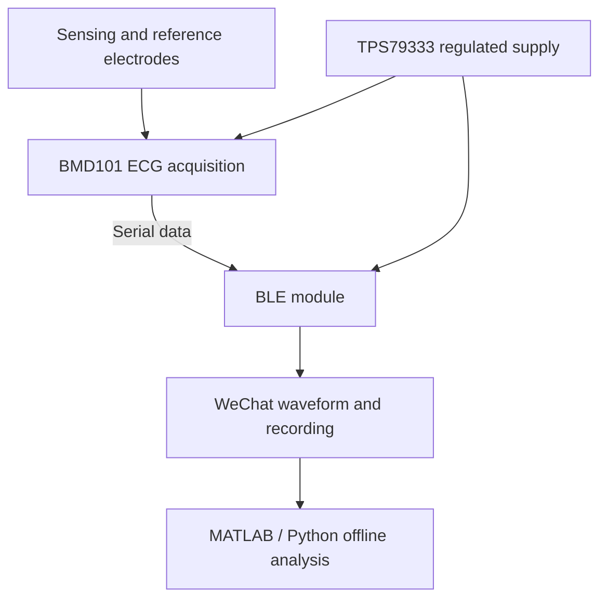

# Wearable ECG Monitoring

**A complete student engineering project: electrodes, hardware architecture, PCB design, SolidWorks enclosure studies, physical prototypes, WeChat software and ECG processing.**

[**Open the project webpage →**](https://jinxiao-wan.github.io/Wearable-ECG-Monitoring/) · [Full picture gallery](docs/gallery.md) · [Development process](docs/development-process.md)

The original 2022–2023 team project explored a flexible wearable ECG sensor with Bluetooth transmission to a WeChat mini program. This repository presents the team's original design figures and photographs, alongside a reproducible software reconstruction added in 2026.


*Original project photograph: circuit boards, enclosure parts and electrode-form prototypes.*

## Project at a glance

| Workstream | What you can see in this repository |
| --- | --- |
| Hardware | Original circuit schematic, electrode concept and documented component chain |
| PCB design | Circuit/layout images and photographs of manufactured boards |
| SolidWorks / mechanical | Exported renders, round housing prototype and wearable enclosure iterations |
| Prototyping | Laboratory, 3D-printing activity, discussion and team-meeting photographs |
| WeChat software | Original app screenshots and code, plus the rebuilt acquisition app |
| Signal processing | Original MATLAB figures, wavelet experiments and reconstructed analysis |
| Outcomes | Completion-material summary and a carefully described utility-model grant notice |

**My main documented contribution:** PCB, filtering and WeChat mini-program development. Hardware, mechanics and PCB were team work. This repository does not imply that one person developed every subsystem.

## 1. Hardware architecture

The original schematic combines the **TPS79333 regulator**, **BMD101 ECG chip** and a **BLE module labelled CC2640R2F**. The BMD101 sensor/reference inputs connect the electrode concept to the data-acquisition chain; serial RX/TX signals connect the acquisition stage and wireless module.




[Hardware design and materials notes](hardware/README.md)

## 2. PCB design

The original presentation includes this routing screenshot. It documents the PCB design work, while the manufactured-part montage above shows physical board prototypes. Their exact revision relationship is not recorded.


[PCB design documentation](pcb/README.md)

## 3. SolidWorks, enclosure and electrodes

The project materials describe SolidWorks modelling for the sensor shape and electrode geometry. The images below pair exported renders with fabricated parts.

| Original round-part render | Fabricated round part |
| --- | --- |
|  |  |

| Petal-and-ring form | Cover form |
| --- | --- |
|  |  |

The team explored a petal-shaped sensing region, a circular reference region and replaceable contact elements around a reusable circuit board. PU, PDMS and PI are named as materials in the design concept; their final properties are not independently verified here.


<p align="center"></p>

*Original wearable prototype photograph.*

[SolidWorks and mechanical design documentation](mechanical/README.md)

## 4. The development process

| Stage | Documented work |
| --- | --- |
| System concept | Define electrode sensing, acquisition, wireless transmission and phone display |
| Design | Study electrode geometry, model the housing, draw the circuit and route the board |
| Prototyping | Fabricate boards and mechanical parts, review them at the laboratory bench |
| Acquisition software | Scan BLE devices, connect, decode samples, display a waveform and export data |
| Signal experiments | Read MIT-BIH ECG data, explore filtering and compute heart rate |
| Review and documentation | Discuss iterations, prepare presentations and completion materials |
| 2026 reconstruction | Repair software, make analysis reproducible and publish this illustrated archive |

| Supervisor-assisted prototyping | Laboratory review |
| --- | --- |
|  |  |

| Team discussion | Remote project meeting |
| --- | --- |
|  |  |

These phases reconstruct the engineering workflow from the supplied evidence. They are not an exact dated manufacturing log.

[Full illustrated development story](docs/development-process.md)

## 5. WeChat software

The original source includes BLE discovery, sample reception, waveform plotting and spreadsheet export. The reconstructed app adds buffered packet parsing, checksum validation, bounded recording, CSV export, actual local history and a hardware-free simulation mode.

| Original monitoring interface | Original history concept |
| --- | --- |
|  |  |

*Historical screenshots from the source presentation. The history example contains placeholder entries.*

[Rebuilt WeChat implementation](wechat/) · [WeChat setup guide](docs/wechat-setup.md)

## 6. Signal-processing work

| Original MATLAB signal figure | Original soft-threshold experiment |
| --- | --- |
|  |  |

The 2026 pipeline analyzes each lead separately, uses the record's sampling rate, detects R peaks and compares them with the supplied annotations. The [webpage's ECG explorer](https://jinxiao-wan.github.io/Wearable-ECG-Monitoring/#results) lets visitors inspect the public sample and download the analysed minute without installing anything.

## 7. Project outputs and credit

The original archive contains proposals, presentations, a commercial plan, completion materials, source code and prototype photographs. It also includes a **19 July 2023 notice to grant a utility model**, titled **“可佩戴心电探测器”**, application **202222528798.X**, naming East China University of Science and Technology as applicant. The notice states that registration formalities remained necessary. Current patent status is not verified, and the administrative pages are not republished.

Original team: **厉晨敏、毕墁莲、万金筱、叶婷婷、冯圣恺、袁亚宁**. Supervisor: **顾震**. Repository and 2026 software reconstruction: **Jinxiao Wan**. The original materials identify 万金筱 among the mini-program contributors; task assignments for some other members differ across the source documents, so individual ownership of every subsystem is not inferred.

## Design files and evidence

**The design pictures are included. Native CAD and fabrication files are missing from the uploaded archives.**

| Asset | Status |
| --- | --- |
| Schematic, PCB layout and mechanical renders | Included as original design images |
| Prototype and development photographs | Included |
| MATLAB and WeChat source | Preserved, with repaired versions alongside |
| SolidWorks SLDPRT/SLDASM/SLDDRW, STEP/STL | Not supplied |
| Altium SchDoc/PcbDoc/PrjPcb, Gerber/drill files | Not supplied |
| Firmware, complete BOM, calibration records | Not supplied |
| Proposed medical/cloud platform | No backend supplied |

[Complete asset inventory](docs/asset-inventory.md) · [Image provenance](docs/visual-sources.json) · [Original-source audit](docs/source-audit.md)

## Repository guide

| Folder | Contents |
| --- | --- |
| `hardware/` | Hardware architecture, recovered component roles and materials concept |
| `pcb/` | Schematic, layout and physical-board evidence |
| `mechanical/` | SolidWorks render/prototype comparisons and asset inventory |
| `demo/` | Complete public project webpage and original project image collection |
| `wechat/` | Rebuilt BLE acquisition, simulation, chart and recording app |
| `src/ecg/` | Python decoding, filtering, beat detection and evaluation |
| `matlab/` | Repaired analysis and optional wavelet denoising |
| `legacy/` | Original first-party source for comparison |
| `data/mitdb/` | One deduplicated copy of supplied MIT-BIH record 100 |
| `docs/` | Illustrated process, gallery, provenance, limitations and results |
| `tests/` | Signal/parser/BLE tests and a webpage browser check |

## Viewing and publishing

Open **https://jinxiao-wan.github.io/Wearable-ECG-Monitoring/** to view the project. The `Publish ECG webpage` workflow deploys `demo/` automatically after changes. GitHub Pages must use **GitHub Actions** as its publishing source.

The commands below are optional developer instructions for reproducing the analysis. Visitors can use the webpage directly.

## Run the analysis

Python 3.10 or newer:

```bash
python -m venv .venv
# Windows PowerShell:
.\.venv\Scripts\Activate.ps1
# Linux / WSL / macOS:
# source .venv/bin/activate
python -m pip install -e .
python -m ecg.cli --seconds 60 --out outputs/minute
python -m ecg.cli --out outputs/full
```

Outputs: `summary.json`, `signal.csv` and `preview.json`. The default is lead MLII; `--channel 1` selects V5. `--record path/to/100` selects another compatible two-channel format-212 record. Each lead is processed separately.

A sensor export can use the same pipeline, with its actual sampling rate:

```bash
python -m ecg.cli --csv path/to/ecg-export.csv --sample-rate 512 --out outputs/sensor
```

**512 Hz is a configurable example, not a verified hardware specification.** Sensor exports remain in raw ADC counts until calibration is known. Dataset samples are in mV. Verify the device rate and packet protocol before interpreting timing or amplitude.

## WeChat and MATLAB

Import **`wechat/`** in WeChat DevTools. Start with simulation, then follow [WeChat setup](docs/wechat-setup.md) for your real sensor. BLE hardware requires a supported real phone and the correct app configuration; it has not been tested here.

From the repository root in MATLAB:

```matlab
addpath('matlab');
result = analyze_ecg('data/mitdb/100', 60, 1);
```

This requires Signal Processing Toolbox. `wavelet_denoise` additionally requires Wavelet Toolbox. The repaired MATLAB files have not been executed in this environment.

## Measured baseline results

MLII only, one-to-one matching within ±100 ms against the supplied beat annotations:

| Window | Detected / annotated beats | False positives | False negatives | F1 |
| --- | ---: | ---: | ---: | ---: |
| First minute | 74 / 74 | 0 | 0 | 1.00000 |
| Complete record, 1,805.56 s | 2,274 / 2,273 | 1 | 0 | 0.99978 |

These are results on **one supplied record**, not clinical validation or performance on the whole MIT-BIH database. The detector is a simple fixed-threshold baseline, not a disease classifier. The original `1hdata` folder contains the same approximately 30-minute recording, so no one-hour result is claimed. See [validation](docs/validation.md).

## Checks

```bash
python -m unittest discover -s tests -v
npm test
```

Node.js 18 or newer is sufficient for the JavaScript tests; no npm dependencies are required. GitHub Actions repeats the checks and a first-minute analysis.


## Source and use notes

All project images come from the supplied original team materials. [Image provenance](docs/visual-sources.json) records their source locations and web-preparation steps. Photos are compressed for web delivery; no generated imagery is presented as project evidence. Original team members retain credit. Personal contact details and administrative documents are excluded.

Public ECG-data attribution and its separate license are in [data/README.md](data/README.md). No blanket license is assigned to the team's original code or design images. This remains a research and learning prototype, not a medical device or diagnostic service.
