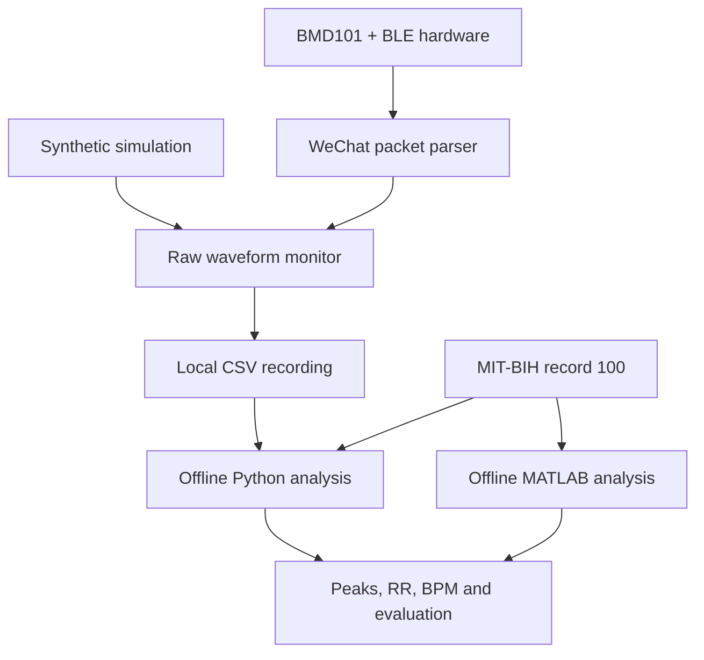

# Architecture

The device packet heart-rate field is displayed as **sensor-reported BPM**, not a value calculated by the mini program. The waveform plot uses raw ADC counts. The desktop pipeline calculates its own median-RR BPM from detected R peaks.

BLE transport is separate from parsing: notifications are byte chunks, not packet boundaries. Parsers retain an incomplete packet between notifications, check the payload checksum, decode signed 16-bit raw samples and ignore unknown payload rows. Format assumptions are reconstructed from the uploaded code, not confirmed against the physical module.

Offline filtering uses a third-order 0.5–40 Hz Butterworth bandpass for display and a separate 5–20 Hz passband for QRS candidates. Zero-phase forward/backward filtering needs the full window; this is **not an online causal filter**. Candidates are refined in a ±60 ms neighbourhood. Median RR and count/duration BPM are reported separately.

The browser explorer contains a ten-second preview plus minute-level metrics. It has no backend or live BLE connection. The mini program stores the latest ten CSV exports locally and has no cloud API, authentication or doctor platform.

## Extension boundaries

- A real device integration needs verified sample rate, service and characteristic UUIDs, start-command semantics and ADC calibration.
- Firmware requires the actual microcontroller/module sources and schematic; neither can be recovered from screenshots.
- Cloud features require a separately designed API and data model. Original placeholder history screens do not establish a working server.
- A disease classifier would require a labelled dataset, a defined task, independent validation and explicit evaluation; none is inferred from the old warning screenshots.
