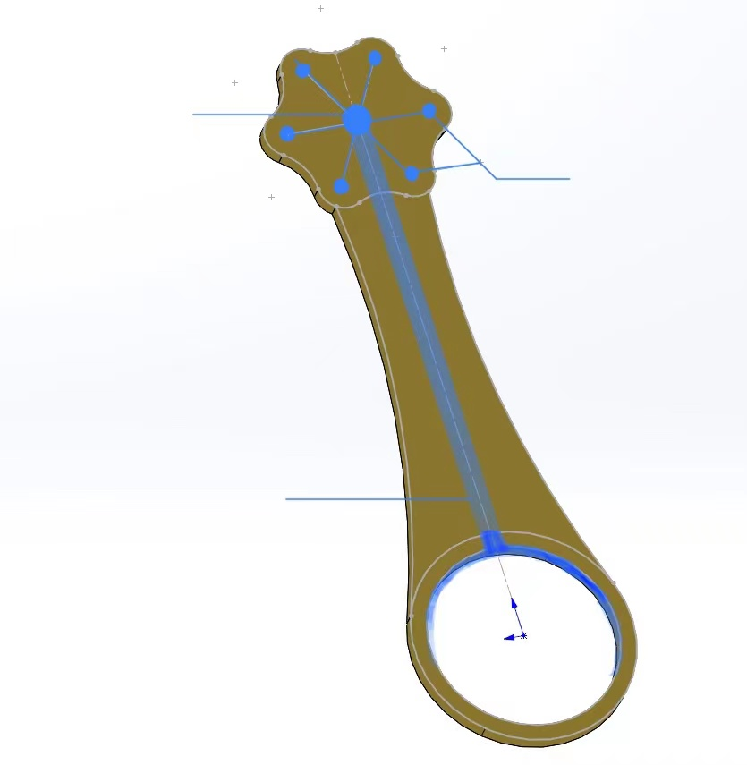
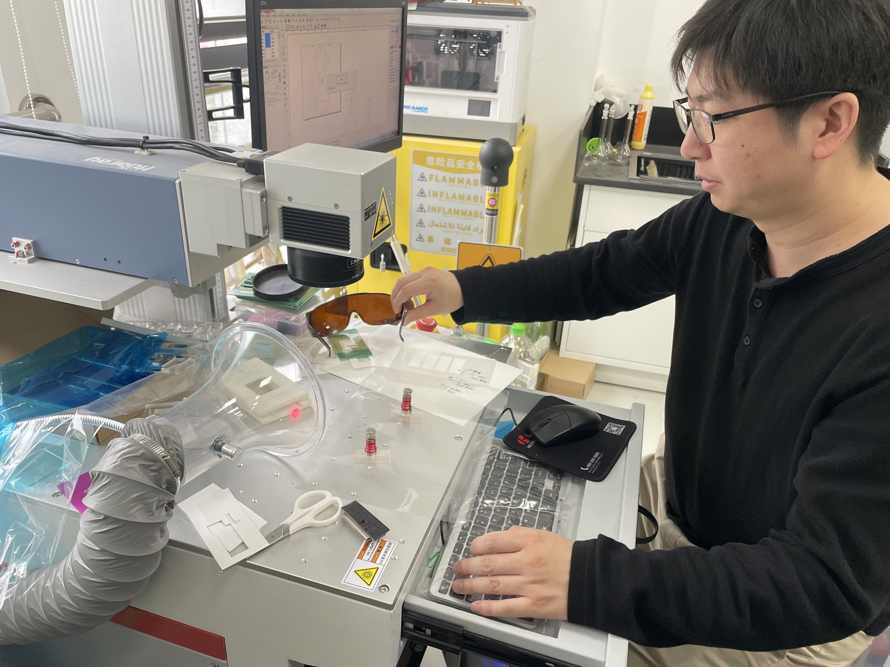
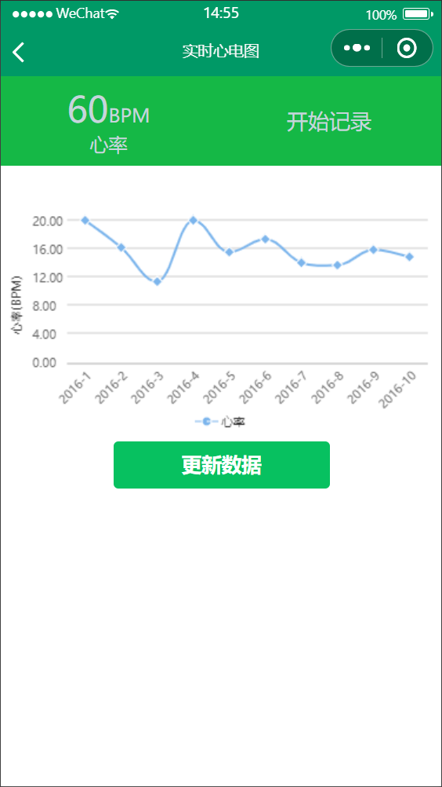
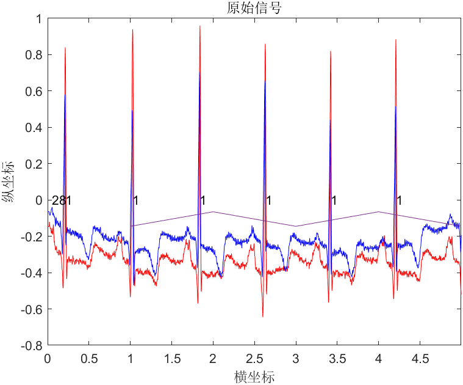
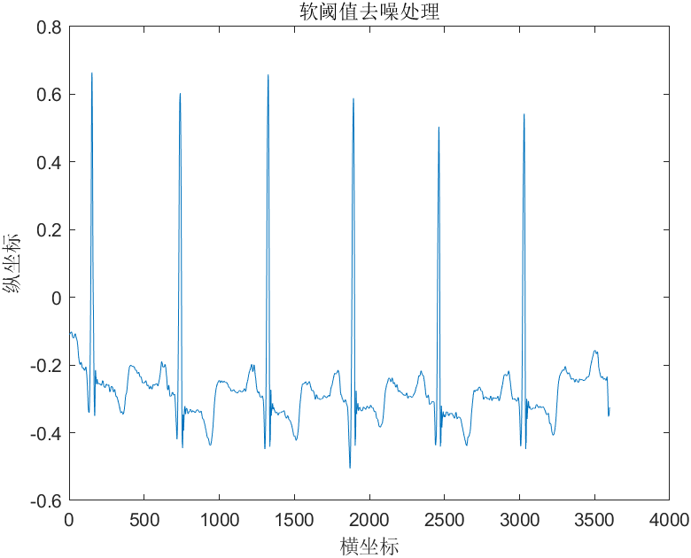
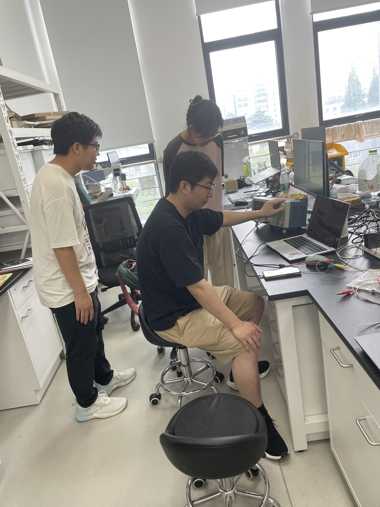
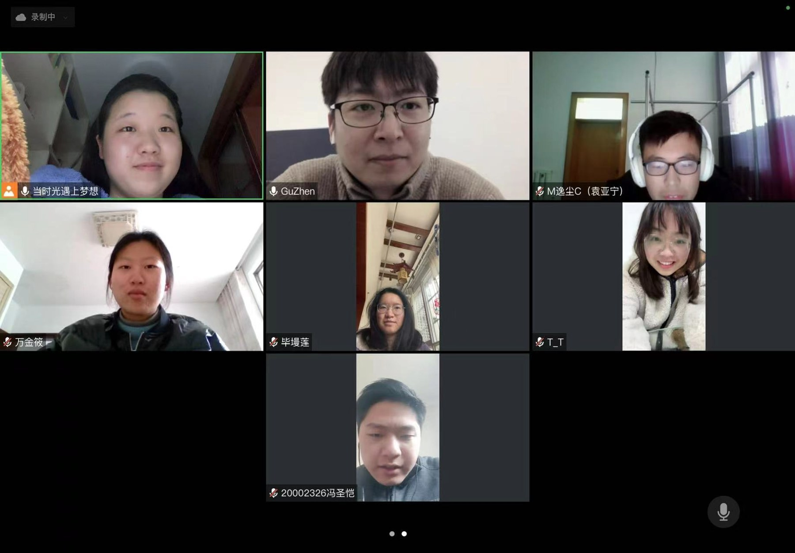

# Development process

This overview follows the engineering workflow visible in the original project materials. The phases below are a logical reconstruction of the process, not a dated manufacturing log. The original project is documented in 2022–2023; the software and public showcase were reconstructed in 2026.

## 1. Problem and system concept

The team explored a small wearable ECG sensor that could send measurements to a phone through BLE. The work spans electrodes, signal acquisition, a wearable enclosure, a circuit board and a WeChat interface. Remote monitoring and commercial deployment were proposed future extensions.

See [hardware design](../hardware/README.md) for the documented component chain and materials concept.

## 2. Electrode and enclosure design

The petal-shaped sensing concept and circular reference informed the mechanical studies. The presentation documents SolidWorks modelling responsibilities and includes several exported form variants. The photographs show fabricated parts alongside the renders.

See [mechanical design](../mechanical/README.md).

## 3. Circuit design and PCB routing

The schematic combines a TPS79333 regulator, BMD101 ECG acquisition chip and a BLE module. The layout screenshot records PCB routing work; prototype photographs record fabricated boards. Their exact revision correspondence is not established.

See [PCB design](../pcb/README.md).

## 4. Prototyping and integration

The project archive documents mechanical prototyping and work on the bench. The photos establish that parts and prototypes were made. They do not establish clinical testing, calibrated accuracy or a production-ready hardware release.

## 5. Bluetooth and WeChat development

The original code scans devices, establishes a BLE connection, receives data, plots a waveform and exports a spreadsheet. Jinxiao Wan's main documented contribution is WeChat mini-program development. The original history screen includes placeholder entries.

The reconstructed app in `wechat/` adds streaming packet boundaries, checksum validation, bounded recording, actual local CSV history and a hardware-free simulation.

## 6. Signal-processing experiments

The original MATLAB work uses MIT-BIH samples for filtering, wavelet-threshold experiments and heart-rate calculation. The reconstruction separates leads, uses the header sample rate and evaluates detected R peaks against supplied annotations. [Validation](validation.md) reports the measured results on record 100.

## 7. Team review and iteration

These photos document collaboration around the project. Team members covered mini-program work, acquisition electronics, PCB development, signal processing and the wearable form. Materials differ in how tasks were allocated, so this repository does not assign every subsystem to one person.

## 8. Documentation and project outputs

The source archive includes a proposal, team presentations, a commercial plan, completion materials, source code and prototype photos. It also contains a **19 July 2023 notice to grant a utility model** titled “可佩戴心电探测器”, application **202222528798.X**, naming East China University of Science and Technology as applicant. The notice states that registration formalities remained necessary. It is not a current patent-status verification. Administrative pages with contact details are not republished.

## 9. Reproducible software and public showcase (2026)

The GitHub reconstruction preserves first-party source, deduplicates record 100 and adds Python analysis, a repaired MATLAB baseline, a rebuilt WeChat app, a browser explorer, tests and this illustrated project archive.

Native CAD, Gerber exports, firmware and the proposed cloud platform remain missing from the supplied materials. See [asset inventory](asset-inventory.md) for the exact boundary between included evidence and editable source files.
