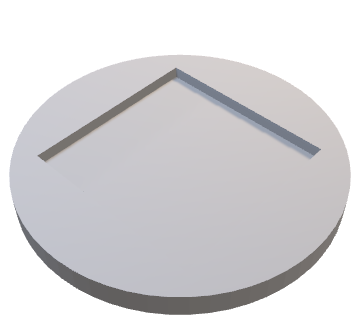
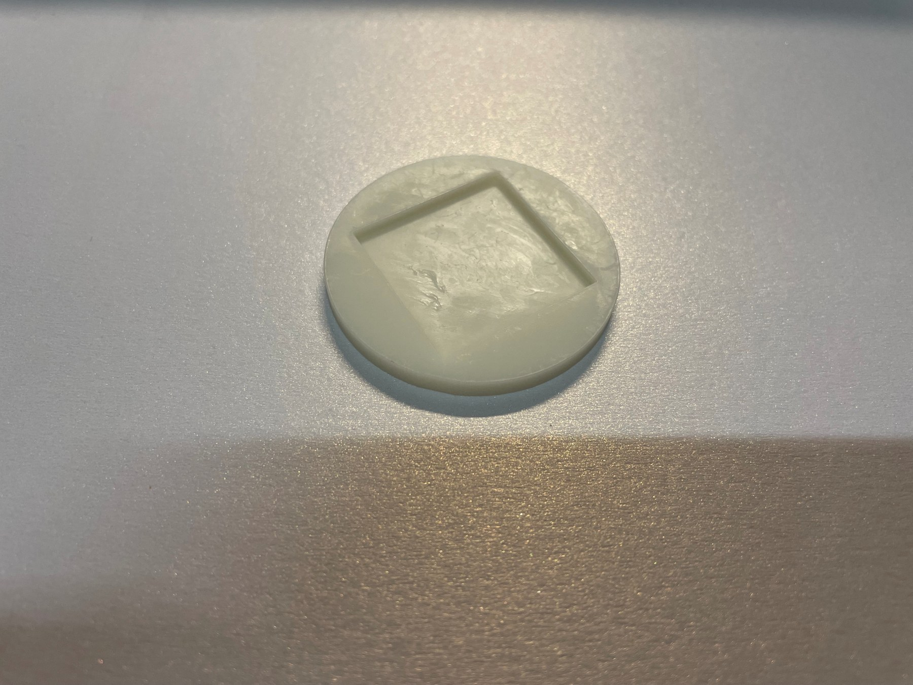
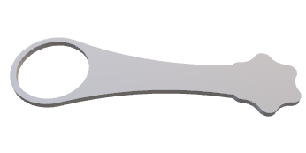
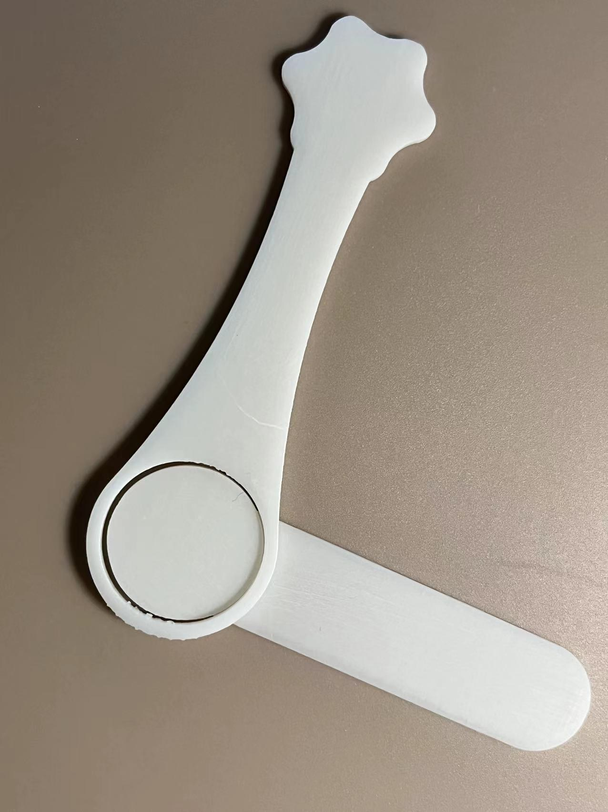
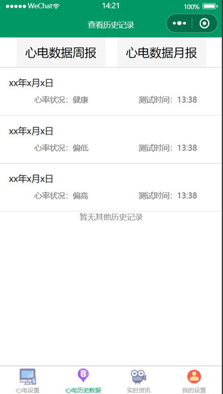
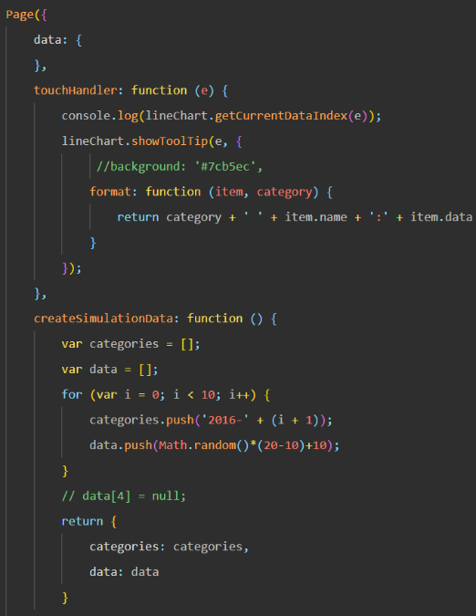

# Project gallery

All photographs and figures below come from the supplied original project materials. Click an image to inspect its full size.

## Hardware and electronics

## Electrode and mechanical design

## Development activities

## Original software experiments

[Source details and captions](visual-sources.json) · [Engineering process](development-process.md)
