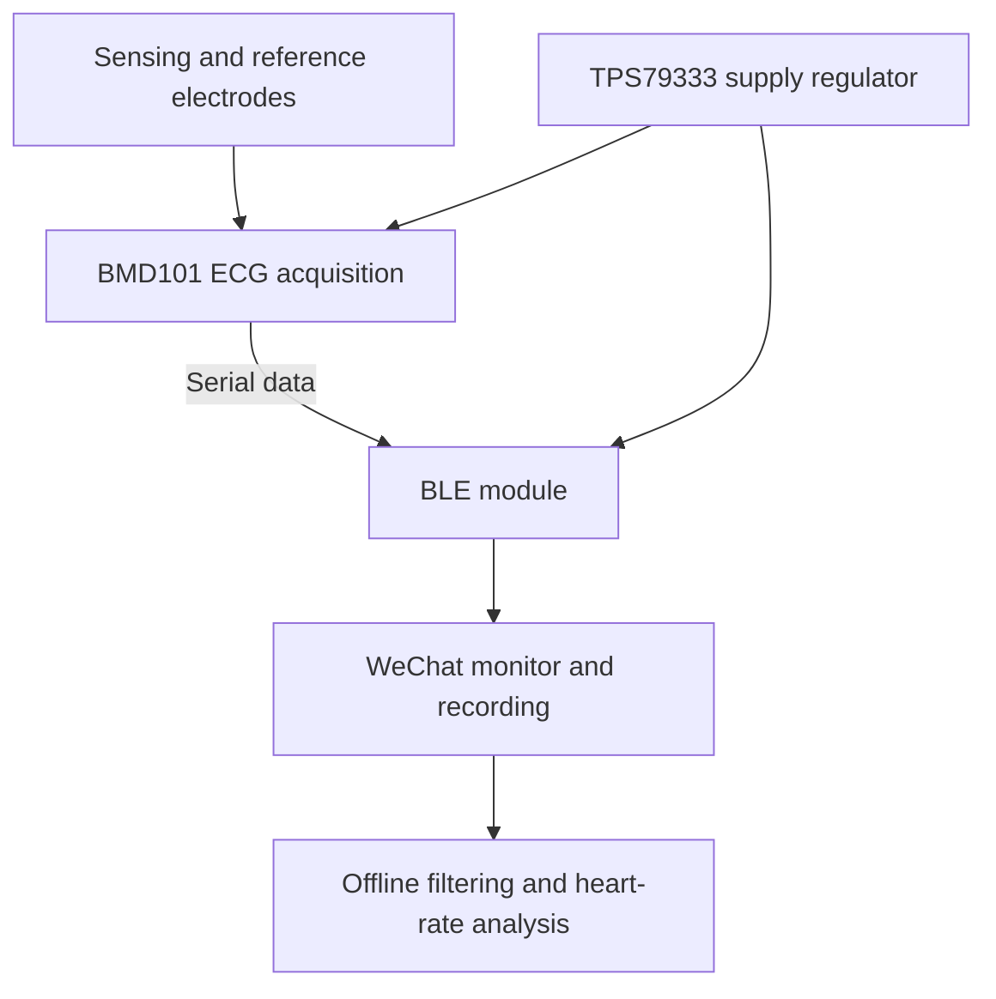

# Hardware design

The original project connects a wearable electrode concept to an ECG acquisition chip and a Bluetooth module. The uploaded presentation documents the circuit below.

## Components visible in the schematic

| Reference | Component | Role in the documented design |
| --- | --- | --- |
| U2 | TPS79333 | Supply regulation; the schematic labels the output rail D3V3 |
| U1 | BMD101 | ECG acquisition; SEN and SENREF sensor inputs, with RX/TX serial pins |
| U3 | BLE module labelled CC2640R2F | Wireless communication; the module symbol includes RX/TX connections |
| C1, C2, C3, C4 | Capacitors | Supply/bypass components shown in the original drawing |
| R1–R5 and LED | Resistors and indicator | Supporting components shown in the original drawing |

This is a recovered design figure, not a newly generated or electrically verified schematic. The exact BLE module part number and pinout still require the original vendor documentation. No MCU firmware or complete bill of materials was included.

## Signal path

The source deck also proposes a medical/cloud platform. A server implementation is not included in the archive or reconstruction.

## Electrode and materials concept

The team proposed a petal-shaped electrode with several contact regions leading to a central region, paired with a circular reference region. The image is a design concept from the original presentation. It is not evidence of a quantified accuracy improvement.

| Material named in the original materials | Intended role |
| --- | --- |
| PU film | Electrode film and skin-contact concept |
| PDMS | Flexible moulded sensor/enclosure concept |
| PI film | Flexible circuit-substrate concept |

The source describes these as intended design choices. The photographs do not independently establish the final material stack, waterproofing, biocompatibility or manufacturing process.

## Physical prototypes

The archive contains photographs of circular fabricated boards, another board beside a ruler, and multiple enclosure/electrode parts. The photograph documents the prototype stage. It does not prove that every board shown corresponds to the recovered rectangular PCB layout.

Continue with [PCB design](../pcb/README.md), [SolidWorks and enclosure design](../mechanical/README.md), or the [full development process](../docs/development-process.md).
