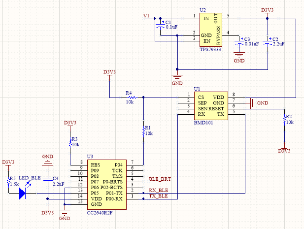
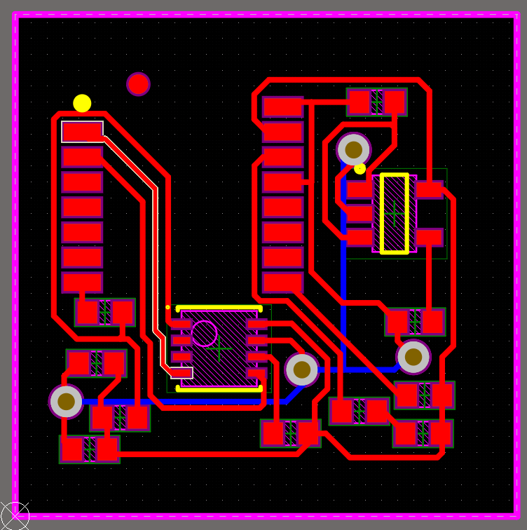
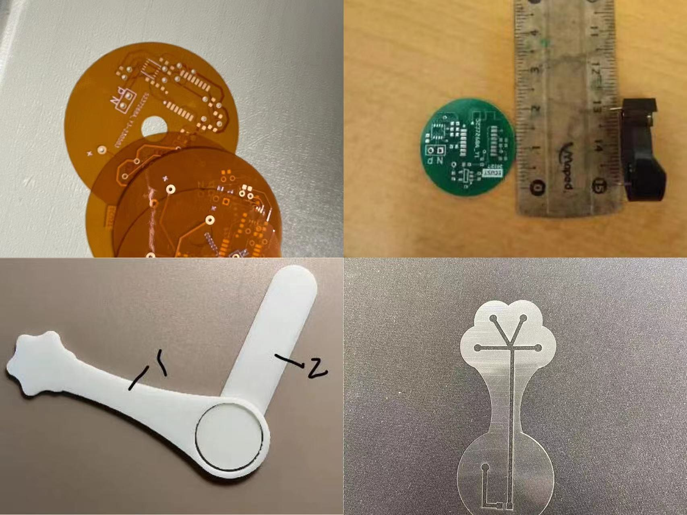

# PCB design

The original team presentation contains the schematic and layout screenshots below. Team materials mention AD/Altium experience for PCB design; the uploaded archives contain no native Altium project.

## Circuit schematic

The drawing connects the regulated supply, BMD101 sensor interface and BLE serial interface. It is the source evidence for the hardware architecture described in [hardware/README.md](../hardware/README.md).

## Layout

The layout image shows routed tracks, footprints, holes/vias and a rectangular board boundary. A screenshot can document design work, but it cannot replace PCB dimensions, stackup, design-rule checks, verified footprints or manufacturing exports.

## Fabricated parts

This montage is labelled “部分实物图” (some physical parts) in the archive. It includes circular boards and a separate green board. Their exact revision relationship to the rectangular layout screenshot is unknown.

## Files available and missing

| Item | Availability |
| --- | --- |
| Circuit schematic image | Included above |
| PCB layout image | Included above |
| Photographs of fabricated boards | Included above |
| `.SchDoc`, `.PcbDoc`, `.PrjPcb` | Not present in uploaded archives |
| Gerber, drill and pick-and-place exports | Not present |
| Editable component libraries and complete BOM | Not present |
| Recorded ERC/DRC and electrical bring-up results | Not present |

This repository showcases the recovered design process. A fabrication-ready PCB release needs the original CAD sources and verification.
